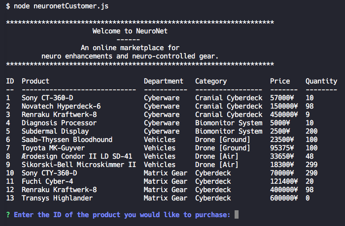
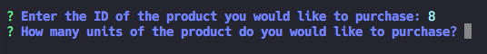
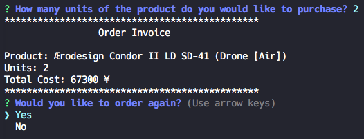
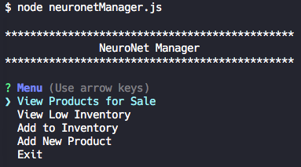
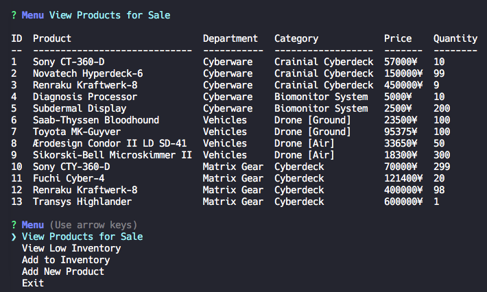
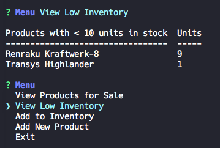
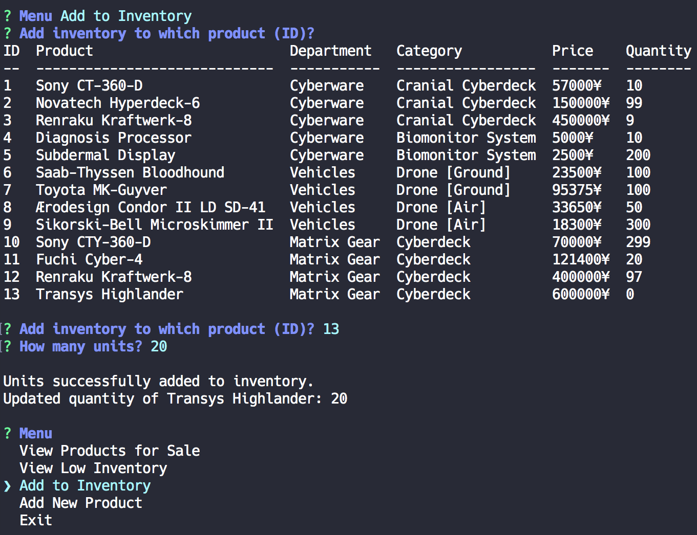
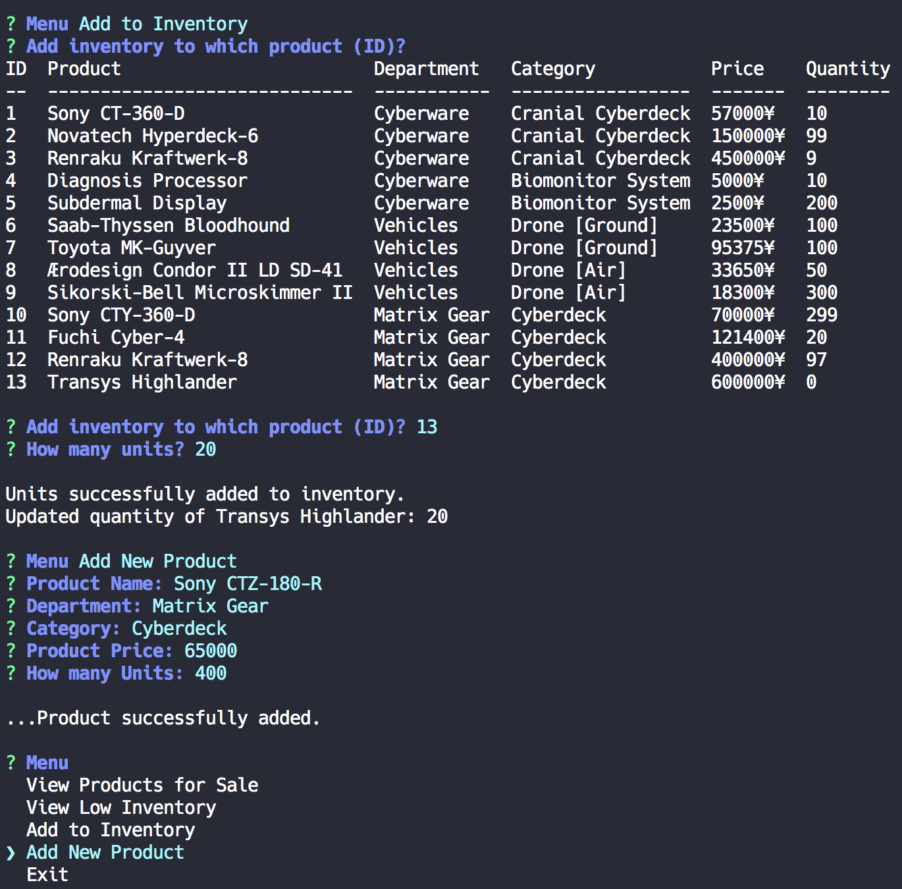
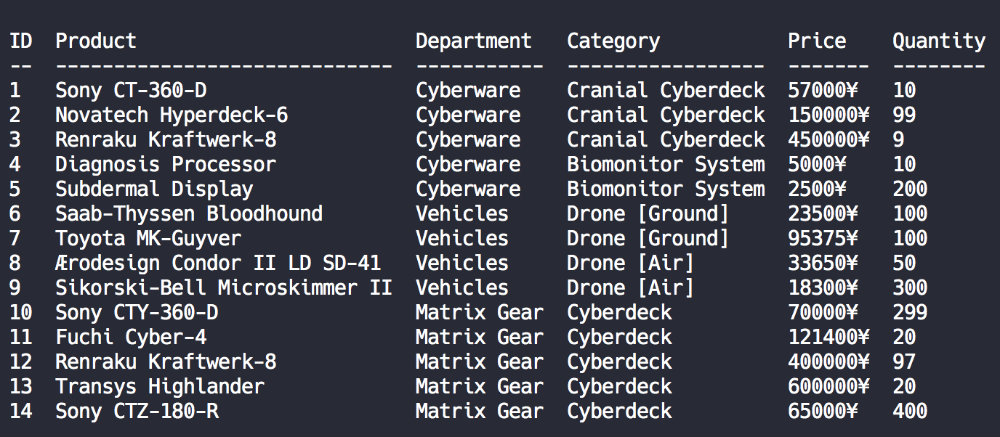

# Welcome to NeuroNet
*An online marketplace for neuro enhancements and neuro-controlled gear.*

### Consumer:

To place an order on NeuroNet, while connected to your neuralHub (bash), run

```
node neuronetCustomer.js
```

This will jack you into *NeuroNet* consumer portal and list all available products for purchase.



Enter the ID number (listed in the leftmost column) of the product you would like to purchase. You will then be prompted to enter the number of units you would like.



After you have entered the number of units you would like to purchase for your selected item, your order invoice will be displayed and you will be asked if you would like to order again.



Selecting **YES**, will start the order process again. Selecting **NO** will jack you out of NeuroNet

### Manager:

To manage NeuroNet, while connected to your neuralHub (bash), run

```
node neuronetManager.js
```

This will jack you into *NeuroNet* manager portal.



From here, you can choose to:

**View Products for Sale** to view all available products in NeuroNet.



**View Low Inventory**



**Add to Inventory**



**Add New Product**



-



*Results from **Add to Inventory** and **Add New Product**.*
